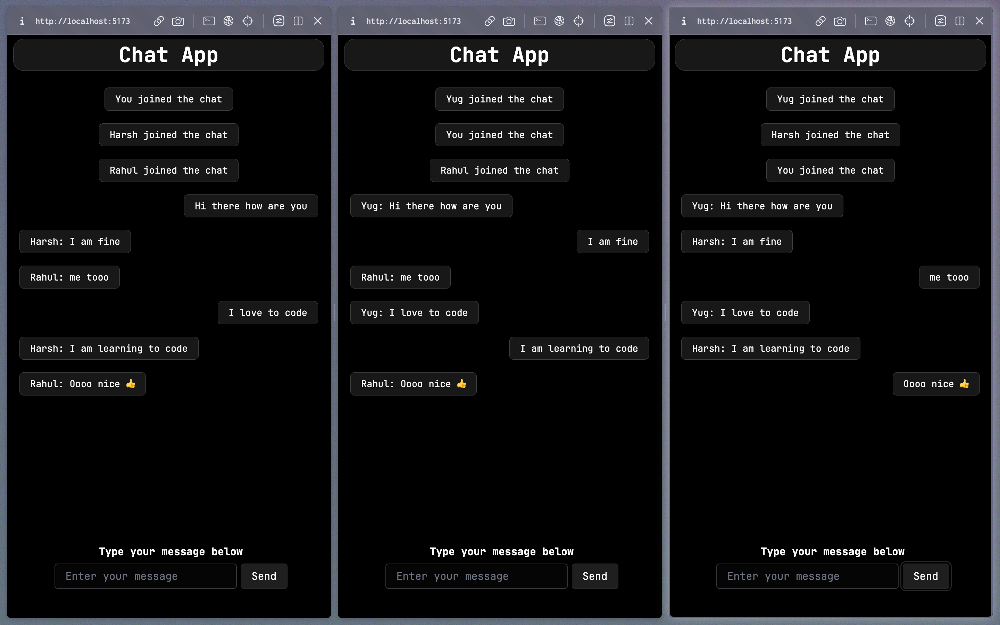

# Chat App with Socket.io

https://github.com/YugBhanushali/Chat-app/assets/95876621/d48da501-88fe-439e-bffa-0a65c85dfdd8

Welcome to the Chat App project! This application allows real-time communication between multiple users using WebSockets through Socket.io. The backend is built with Node.js, while the frontend is developed using React with Vite as the build tool.

## Features

- Real-time messaging: Users can send and receive messages in real-time, creating a seamless chat experience.

## Technologies Used

- Backend: Node.js, Socket.io
- Frontend: React, Vite, Socket.io-client,Typescript

## Installation

### Prerequisites

- Node.js (v14 or higher)
- npm (Node Package Manager)

### Backend Setup

1. Navigate to the `server` directory: `cd server`.
2. Install the required packages: `npm install`.
3. Start the backend server: `npm start`.

The backend server will be running on `http://localhost:3001`.

### Frontend Setup

1. Navigate to the `client` directory: `cd client`.
2. Install the required packages: `npm install`.
3. Start the development server: `npm run dev`.

The frontend development server will be running on `http://localhost:3000`.

## Usage

1. Open your web browser and visit `http://localhost:3000`.
2. Enter your desired username and join the chat room.
3. Start sending and receiving messages in real-time!

## Configuration

- Backend configuration can be found in `server/index.js`.
- Frontend configuration can be found in `client/src/config.js`.

Feel free to reach out if you have any questions or need further assistance. Happy chatting! 🎉
